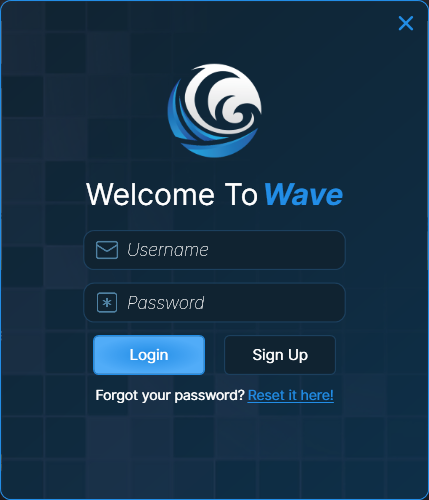
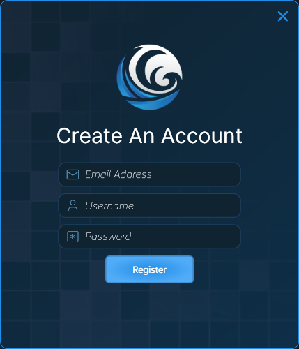
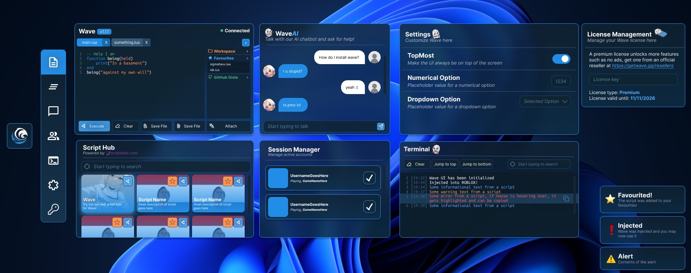
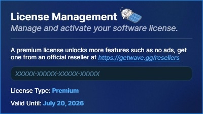

# 🌊 Getting Started

* Let's get you started with where to download Wave.

## Download

* [https://getwave.gg](https://getwave.gg)&#x20;


This is our one, and only official website for Wave. Anyone regarding a different site for Wave is a scam and is phishing you to download their fake software.


## Installation

You can follow the instructions below to get the best experience & installation process out of Wave!

After downloading Wave from the link above, you can proceed by doing the steps below:

* Click _**`Download`**_ on the landing page.

> You will then be prompted to download _**`WaveWindows`**_.

## Register

Now that you've made it this far into getting Wave, all you need to do is register an account.

<figure><figcaption>
<em>Login Prompt for Wave</em>
</figcaption></figure>

*   Click the <mark style="color:blue;">Sign Up</mark> button at the bottom of the Login Prompt.

    <figure><figcaption>
<em>Sign Up Prompt for Wave</em>
</figcaption></figure>
* Enter an <mark style="color:$info;">Email</mark>, <mark style="color:$info;">Username</mark>, and <mark style="color:$info;">Password</mark> that you can <mark style="color:$danger;">remember</mark>.
* Once you're done, click the <mark style="color:blue;">Register</mark> button on the prompt.

> <mark style="color:$success;">Congratulations</mark>, you now have access to the main Wave User-Interface!

<figure><figcaption>
<em>Wave User-Interface</em>
</figcaption></figure>

## Redeem Your Key

*   In order to use Wave, you need a key for the software to function as it is supposed to.

    * For <mark style="color:yellow;">Free</mark> users, you <mark style="color:$warning;">must</mark> go through <mark style="color:$info;">Linkvertise</mark> and grab your key from there.

    > [https://key.getwave.gg/](https://key.getwave.gg/)

    * For <mark style="color:green;">Premium</mark> users, you <mark style="color:$warning;">must</mark> buy a key from one of our <mark style="color:$info;">official resellers</mark> that you can find easily <mark style="color:$info;">on our website</mark>.

    > [https://getwave.gg/resellers](https://getwave.gg/resellers)

* To actually redeem the key, <mark style="color:$info;">click</mark> the <mark style="color:blue;">Key logo</mark> on the <mark style="color:$info;">side-panel</mark>.
* From there, input your key where it says _`XXXXX-XXXXX-XXXXX-XXXXX`_.

<figure><figcaption>
<em>Key > License Management Prompt on Wave User-Interface</em>
</figcaption></figure>
